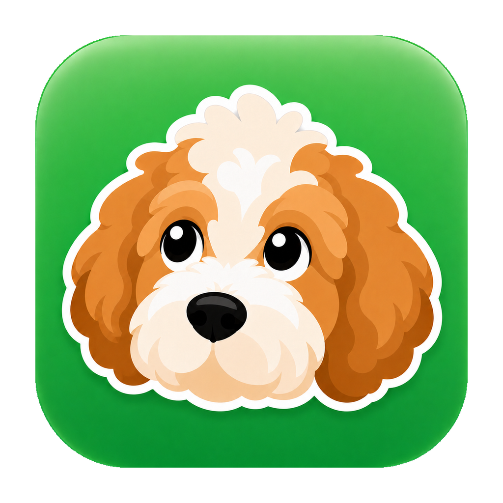

<p align="center">
  
</p>

# Boop

A Telegram-based personal agent you can run with your Claude Code subscription, your Codex / ChatGPT subscription, or any OpenAI-compatible API endpoint.

Choose your runtime during setup:

- **Claude** — powered by the [Claude Agent SDK](https://docs.claude.com/en/api/agent-sdk/overview) and your local Claude Code login.
- **Codex** — powered by the local Codex app-server runtime and your local `codex login`.
- **Custom API** — any OpenAI-compatible chat completions endpoint (Ollama, LM Studio, OpenRouter, vLLM, …) called directly over HTTP with the `openai` SDK. No CLI to install.

No Anthropic or OpenAI API key is required for the agent runtime when using subscription auth.

📺 **Watch the original walkthrough:** [YouTube — How I built Boop](https://youtu.be/ZpmKjDDbqHs)

> **This is a starting point, not a finished product.**
> It's the architecture built for a personal agent, opened up as a template so you can take it, connect your own Claude or Codex-backed agent to Telegram, and extend it however you want. Integrations are plugged in via [Composio](https://composio.dev/?utm_source=chris&utm_medium=youtube&utm_campaign=collab) — drop in an API key and connect Gmail, Slack, GitHub, Linear, Notion, and ~1000 others straight from the debug dashboard.

```
 Telegram  →  Bot webhook  →  Interaction agent  →  Sub-agents (per task)
                                      │                    │
                                      ▼                    ▼
                                Memory store  ←──  Integrations (your MCP tools)
```

Built on:
- [Claude Agent SDK](https://github.com/anthropics/claude-agent-sdk-typescript), local Codex runtime, or any OpenAI-compatible endpoint — choose your provider during setup
- [grammY](https://grammy.dev) — Telegram Bot framework (webhook handler, typing indicator, message chunking)
- [Composio](https://composio.dev/?utm_source=chris&utm_medium=youtube&utm_campaign=collab) — integrations layer. One API key = Gmail, Slack, GitHub, Linear, Notion, Stripe, Supabase, + ~1000 more with hosted OAuth
- [Convex](https://convex.link/chrisraroque) — real-time database for memory, agents, drafts
- Your Claude Code or Codex/ChatGPT subscription — no separate provider API key required

---

## What you get

- **Telegram in / Telegram out** via the Bot API (with typing indicators and 4096-char chunking).
- **Webhook auto-registration** — `npm run dev` auto-registers the inbound webhook with Telegram every restart on free ngrok. Stable domains (ngrok reserved / Cloudflare Tunnel) register once and skip from then on.
- **Dispatcher + workers** pattern: a lean interaction agent decides what to do, spawns focused sub-agents that actually do the work.
- **Pure dispatcher** — the interaction agent has only memory + spawn + automation + draft tools. Web access, files, and integrations are explicitly denied to it; sub-agents get `WebSearch` / `WebFetch` / the integrations.
- **Tiered memory** (short / long / permanent) with post-turn extraction, decay, and cleaning.
- **Vector search** for recall with a local BGE-large fallback, or optional Voyage/OpenAI embeddings.
- **Memory consolidation** — a daily 3-phase adversarial pipeline (proposer → adversary → judge) that merges duplicates, resolves contradictions, and prunes noise. Uses the configured runtime, with provider-specific model defaults. Runs every 24h by default, also triggerable manually via `POST /consolidate`.
- **Automations** — the agent can schedule recurring work from a text ("every morning at 8 summarize my calendar") and push results back to Telegram.
- **Draft-and-send** — any external action stages a draft first; the agent only commits when the user confirms.
- **Heartbeat + retry** — stuck agents auto-fail, debug dashboard can retry.
- **Admin guard** — set `TELEGRAM_ADMIN_USER_IDS` to restrict the bot to your user IDs only.
- **Composio-powered integrations** — one API key unlocks 1000+ toolkits. Connect Gmail, Slack, GitHub, Linear, Notion, Drive, HubSpot, etc. with a click from the debug dashboard. Composio handles OAuth + token refresh.
- **Optional local browser use** — when enabled in Settings, spawned agents can use a Patchright-backed Chrome profile for login-required services, visual workflows, or pages that reject ordinary automation.
- **Optional local Apple data** — Mac-only, read-only iMessage, Apple Notes, and Apple Reminders connectors that stay off until you enable Apple data and connect each source in the debug dashboard.
- **Debug dashboard** (React + Vite) with a Boop mascot — Dashboard (usage, known cost, tokens, agent status), Agents (timeline + integration logos), Automations, Memory (table + force-directed graph), Events, Connections.
- **Convex** for persistence — real-time, typed, free tier.
- **Docker Compose** for self-hosting — one `docker compose up -d` and you're running.
- **Uses your Claude Code or Codex/ChatGPT subscription** — choose during setup, with no separate provider API key required — **or any OpenAI-compatible endpoint** (Custom API) if you bring your own base URL, key, and model.

<p align="center">
  
  <br>
  <sub><em>Agents tab — every spawned sub-agent with status, usage/cost, tokens, turns, runtime, and the integrations it touched.</em></sub>
</p>

<p align="center">
  
  <br>
  <sub><em>Automations tab — schedule recurring jobs from a text ("every morning at 8 summarize my calendar") and watch them run.</em></sub>
</p>

<p align="center">
  
  <br>
  <sub><em>Memory tab — force-directed graph of clustered memories across short, long, and permanent tiers. Tabular view also available.</em></sub>
</p>

<p align="center">
  
  <br>
  <sub><em>Connections tab — Composio toolkits with OAuth handled for you. Click Connect and the agent can use it on the next message.</em></sub>
</p>

---

## Heads up before you use this

- **This was never meant to be open-sourced.** Built for personal use and shared because enough people asked. It's not a product.
- **Not optimized for cost or security.** Use at your own risk. Review the code, set your own budgets, and don't trust it with anything you wouldn't trust yourself with.
- **I'm open to PRs for optimizations** — performance, bug fixes, DX improvements, new example integrations, better docs.

---

## Why is it named Boop?

<p align="center">
  
  <br>
  <sub><em>Luna, the inspiration.</em></sub>
</p>

Boop is meant to be a proactive agent — one that nudges you over Telegram with reminders, drafts, and little follow-ups. A small "boop" whenever it has something for you.

And it's named after the original creator's dog, Luna, who gives plenty of them.

---

## Prerequisites

You need accounts for these. Keep the tabs open — setup will ask for credentials from each.

> **You should be able to get away with the free plan for each service except your chosen agent subscription, and I'm working to secure discounts for you guys on the pro plans. If you work at any of these companies, please reach out!**

| Service | Why | Free? | Discount code |
|---|---|---|---|
| [Claude Code](https://claude.com/code?ref=chrisraroque) or Codex / ChatGPT | Powers the agent. Install the matching CLI, sign in once, Boop uses your local session. Not needed if you pick the Custom API runtime instead (see below). | Subscription required | Working on getting one (if you work here, please reach out!) |
| OpenAI-compatible endpoint (optional) | Alternative to the subscriptions above: any chat completions API — Ollama, LM Studio, OpenRouter, vLLM, etc. No CLI required; setup asks for base URL, API key, and model. | Depends on the endpoint | — |
| Telegram Bot | Create a bot with [@BotFather](https://t.me/BotFather) — `/newbot`, copy the token. | Free | — |
| [Convex](https://convex.link/chrisraroque) | Database + realtime. | Free tier is plenty | Working on getting one (in touch with them 👀) |
| [Composio](https://composio.dev/?utm_source=chris&utm_medium=youtube&utm_campaign=collab) | Integrations — one API key unlocks ~1000 toolkits. Optional if you just want chat + memory + automations without third-party access. | Free tier covers personal use | `CHRISXCOMPOSIO` — 1 month free on starter plan |
| [ngrok](https://ngrok.com?ref=chrisraroque) or similar | Expose your local port so Telegram can reach it. | Free tier works | Working on getting one (if you work here, please reach out!) |

**Custom integrations welcome.** Composio covers the common catalog, but you're free to add your own MCP servers under `server/integrations/` and register them in `server/integrations/registry.ts` — the dispatcher treats them the same as Composio-backed ones (just named toolkits the execution agent can spawn against). Useful for in-house APIs, local tools, or anything Composio doesn't ship.

**Local browser use is fully optional.** Boop can expose a local Chrome/Chromium profile to spawned agents, but it is off by default. Enable it from the debug dashboard under **Settings → Local browser use** when you want browser automation for login-only services, visual workflows, or bot-wall-sensitive pages. The Patchright browser binary is installed only if you opt in during setup or click the install button in Settings.

---

## Quickstart

```bash
# 1. Clone + install
git clone https://github.com/lucasliet/boop-agent.git
cd boop-agent
npm install

# 2. Install one agent runtime (one-time, global) and sign in
#    (skip this step if you plan to use the Custom API runtime — no CLI needed)
npm install -g @anthropic-ai/claude-code
claude  # sign in, then Ctrl-C to exit
# or:
npm install -g @openai/codex
codex login

# 3. Create a Telegram bot — talk to @BotFather on Telegram:
#    /newbot → follow prompts → copy the token it gives you

# 4. Interactive setup — writes .env.local, creates Convex deployment, offers optional local browser use
npm run setup

# 5. Install ngrok (one-time) and authorize it
brew install ngrok
# or grab from https://ngrok.com/download
ngrok config add-authtoken <your-token>   # free at https://dashboard.ngrok.com

# 6. Start everything with one command — server, Convex, debug UI, and ngrok
npm run dev
```

`npm run dev` prints color-prefixed output from all four processes and shows a banner with your public webhook URL once the tunnel is live.

```
🐶 Debug dashboard:   http://localhost:5173
🌐 Public URL:        https://<abc123>.ngrok-free.app
📮 Telegram webhook:  https://<abc123>.ngrok-free.app/telegram/webhook
```

On free ngrok, **the webhook auto-registers with Telegram every boot** — no manual paste needed. For stable URLs (ngrok reserved or Cloudflare Tunnel), the webhook registers once and is skipped on subsequent boots.

Text your bot from Telegram. The agent replies.

### Native App

<p align="center">
  
</p>

Boop also has an experimental dedicated desktop app for people who want to launch it from the Dock instead of keeping a terminal open. The app starts the same stack as `npm run dev`, embeds the debug dashboard when everything is ready, and gives you start, stop, restart, and server-status controls directly in the app. The dashboard's Connection header is where you can see the running server, Convex, dashboard, tunnel, Telegram webhook registration, and Convex URL.

**Important:** `npm run setup` does not build or install the desktop app. It configures the checkout you are standing in: it creates or updates `.env.local`, walks through the runtime choice, configures your Telegram bot, creates or reuses the Convex deployment, generates Convex files, and offers optional local browser support. You still need to run setup at least once before Boop can run. If you want the installed app to run by itself, use `npm run desktop:setup`; that command runs the same interactive setup inside the app's runtime folder.

```bash
npm run desktop:setup  # recommended: setup app runtime, build app, optionally copy to /Applications
npm run desktop:dev    # experimental: run the app from this checkout, after npm run setup
npm run desktop:pack   # build an unsigned app bundle in dist/mac-arm64
npm run desktop:dist   # build unsigned distributables
```

| Command | What happens | Installs the app? |
|---|---|---|
| `npm run setup` | Configures this checkout for terminal/dev use. Writes `.env.local`, configures your Telegram bot, sets up Convex, generates Convex files, and can install optional browser support. | No |
| `npm run desktop:setup` | Prepares the app runtime folder, runs the same interactive setup there, builds the app, and on macOS offers to copy `Boop.app` to `/Applications`. | Yes, if you accept the `/Applications` prompt |
| `npm run desktop:dev` | Experimental developer runner. Opens the desktop app from this checkout and uses this checkout's setup files. | No |
| `npm run desktop:pack` | Creates an unsigned app bundle under `dist/` for local testing. | No, it only builds |
| `npm run desktop:dist` | Creates unsigned distributable artifacts. | No, it only builds |

The app keeps secrets and local state out of the app bundle. For an installed macOS app, `.env.local`, `.convex`, generated Convex files, and local data live under `~/Library/Application Support/Boop/runtime`. The app bundle contains the runnable project and the Boop app icon; the runtime folder contains the machine-specific setup. The optional local BGE-large embedding model is not bundled either: setup downloads about 1.3GB into the runtime's `data/` folder when you choose it. Only health checks and provider webhook routes are exposed through the public tunnel; dashboard, browser-control, and local configuration routes remain local to your Mac.

> **⚠ ngrok free plan gives you a new URL every time.** That means every time you restart `npm run dev`, your Telegram webhook URL is dead until re-registered.
>
> If you're going to run this for more than a quick demo, **strongly recommend one of:**
> - **ngrok paid plan** — gives you a reserved domain that stays the same forever (set `NGROK_DOMAIN` in `.env.local`)
> - **[Cloudflare Tunnel](https://developers.cloudflare.com/cloudflare-one/connections/connect-networks/)** — free, stable subdomain, a bit more setup
> - Any other tunnel with a static URL
>
> If you use a non-ngrok tunnel, point it at `localhost:3456` yourself — `npm run dev` will still run the rest. Set `PUBLIC_URL` in `.env.local` and run `npm run telegram:webhook` once.

---

## How the Telegram integration works

### Bot setup

1. Talk to [@BotFather](https://t.me/BotFather) on Telegram.
2. Send `/newbot`, pick a name and username.
3. Copy the token (`123456:ABC-DEF...`) into `BOT_TOKEN` in `.env.local`.

### `npm run dev` lifecycle

```
 1. Preflight: confirm convex/_generated/ exists (else prompt to run setup).
 2. Spawn four children in parallel, each with a prefixed log stream:
       server │   (tsx watch server/index.ts)
       convex │   (npx convex dev — pushes schema + functions)
       debug  │   (vite dev server on :5173)
       ngrok  │   (if installed AND no static URL) exposes :PORT
 3. Wait for all four readiness signals:
       server → "listening on :PORT"
       convex → "Convex functions ready"
       debug  → "Local:  http://localhost:5173/"
       ngrok  → tunnel URL visible at http://127.0.0.1:4040
 4. Auto-register the webhook (FREE ngrok only, not reserved domains):
       webhook │ [telegram-webhook] registered https://abc123.ngrok-free.app/telegram/webhook
 5. Show the banner with dashboard + public URL + webhook.
```

### When auto-register fires vs when it doesn't

| Setup | Auto-register fires? | Why |
|---|---|---|
| Free ngrok (default) | **Yes**, every boot | URL rotates; Telegram would be pointing at a dead URL otherwise |
| Reserved `NGROK_DOMAIN` | No | URL is stable; register once with `npm run telegram:webhook` |
| Static `PUBLIC_URL` (Cloudflare Tunnel etc.) | No | Same reason |
| `TELEGRAM_AUTO_WEBHOOK=false` | No | Manual opt-out |

### Manual webhook registration

```bash
npm run telegram:webhook -- https://your-domain.example.com/telegram/webhook
```

Or, using the script directly:

```bash
node scripts/telegram-webhook.mjs https://your-domain.example.com/telegram/webhook
```

### Admin guard

Set `TELEGRAM_ADMIN_USER_IDS` to a pipe-separated list of Telegram user IDs. Anyone not on the list gets a "Sorry, I'm a private bot." reply.

To find your user ID: talk to [@userinfobot](https://t.me/userinfobot) on Telegram.

```env
TELEGRAM_ADMIN_USER_IDS=123456789|987654321
```

### What you'll see in the server logs during a conversation

```
server │ [turn a3f21d] ← 123456789: "what's on my calendar today?"
server │ [turn a3f21d] tool: recall({"query":"calendar today"})
server │ [turn a3f21d] tool: spawn_agent({"integrations":["google-calendar"],"task":"Pull today's events"})
server │ [agent 9e82c1] spawn: google-calendar — "Pull today's events"
server │ [agent 9e82c1] tool: list_events
server │ [agent 9e82c1] done (completed, 2.1s, in/out tokens 1234/567)
server │ [turn a3f21d] → reply (3.4s, 140 chars): "Light day — just your 2pm with Sarah..."
server │ [telegram] → sent 140 chars to 123456789
```

The same events are written to Convex and streamed to the debug dashboard in real time.

---

## Self-hosting with Docker Compose

Boop ships a `docker-compose.yml` for running the server persistently — no `npm run dev` needed.

### 1. Create the bot and get credentials

- Talk to [@BotFather](https://t.me/BotFather): `/newbot` → copy the token.
- Your Convex project must exist. Run `npx convex dev --once` once on your local machine and copy the `CONVEX_URL` from [dashboard.convex.dev](https://dashboard.convex.dev).

### 2. Configure

```bash
git clone https://github.com/lucasliet/boop-agent.git
cd boop-agent
cp .env.example .env.local
```

Edit `.env.local`:

```env
# Required
BOT_TOKEN=123456:ABC-DEF...
CONVEX_URL=https://your-project.convex.cloud
VITE_CONVEX_URL=https://your-project.convex.cloud

# Recommended
TELEGRAM_WEBHOOK_SECRET=any-random-string
TELEGRAM_ADMIN_USER_IDS=your_telegram_user_id

# Optional
ANTHROPIC_API_KEY=sk-ant-...   # if not using Claude Code subscription
COMPOSIO_API_KEY=sk-comp-...
```

### 3. Start the server

```bash
docker compose up -d
```

The `boop-server` container runs on port `3456`. Now you need to expose it to Telegram (HTTPS required).

### 4. Expose the server

**Option A — ngrok with tunnel profile (easiest for testing):**

```bash
export NGROK_AUTHTOKEN=ngrok_...
docker compose --profile tunnel up -d
```

The `webhook` sidecar polls ngrok's local API, gets the HTTPS URL, and calls `scripts/telegram-webhook.mjs` automatically.

**Option B — Cloudflare Tunnel (recommended for production, free):**

```bash
cloudflared tunnel --url http://localhost:3456
```

Then register the webhook once:

```bash
node scripts/telegram-webhook.mjs https://your-subdomain.trycloudflare.com/telegram/webhook
```

**Option C — Reverse proxy with your own domain (nginx / Caddy):**

Point `https://yourdomain.com → localhost:3456` and register:

```bash
node scripts/telegram-webhook.mjs https://yourdomain.com/telegram/webhook
```

### 5. Test

Send a message to your bot in Telegram — it should reply.

### Useful commands

```bash
docker compose logs -f server     # tail logs
docker compose restart server     # restart after changing .env.local
docker compose pull && docker compose up -d --build   # update to latest
docker compose down               # stop everything
```

---

## Architecture in 30 seconds

```
┌─────────────┐    webhook     ┌──────────────────────┐
│   Telegram  │ ─────────────► │ /telegram/webhook    │
└─────────────┘                └──────────┬───────────┘
                                          │
                                          ▼
                          ┌────────────────────────────┐
                          │    Interaction agent       │
                          │    (dispatcher only)       │
                          │  • recall / write_memory   │
                          │  • spawn_agent(...)        │
                          └────────┬────────┬──────────┘
                                   │        │
                   ┌───────────────┘        └──────────────┐
                   ▼                                       ▼
           ┌───────────────┐                      ┌──────────────┐
           │   Memory      │                      │  Execution   │
           │ (Convex)      │                      │  agent(s)    │
           │ + cleaning    │                      │  + integrations│
           └───────────────┘                      └──────────────┘
```

- **Interaction agent** (`server/interaction-agent.ts`) is the front door. It reads the user's message + recent history, optionally calls `recall`, writes memories, creates automations, and decides whether to answer directly or spawn a sub-agent.
- **Execution agent** (`server/execution-agent.ts`) is spawned per task. It loads only the integrations named in the spawn call and returns a tight answer.
- **Memory** (`server/memory/`) handles writes, recall, post-turn extraction, and daily cleaning. Stored in Convex.
- **Automations** (`server/automations.ts`) poll every 30s for due jobs, spawn an execution agent to run them, and push results back to the user via Telegram.
- **Integrations** are provided by [Composio](https://composio.dev/?utm_source=chris&utm_medium=youtube&utm_campaign=collab). The dispatcher names toolkits by slug (`spawn_agent(integrations: ["gmail"])`); `server/composio.ts` opens a toolkit-scoped Composio session per spawn and wraps its tools as an MCP server. No per-integration code to write.
- **Local browser use** is a separate optional integration named `browser`. It appears to the dispatcher only after you enable it in Settings, and it controls a persistent local Chrome profile through Patchright.

Deep dive: [ARCHITECTURE.md](./ARCHITECTURE.md). Adding your own tools: [INTEGRATIONS.md](./INTEGRATIONS.md).

---

## Skills

Skills are reusable playbooks — `SKILL.md` files that teach execution agents how to do a specific kind of task (write a YouTube script, draft a cold email, plan a trip, etc.).

Boop now has three runtime paths, so keep this distinction in mind:

- Claude runtime: the Claude Agent SDK loads project skills from `.claude/skills/` when the execution agent boots.
- Codex runtime: Boop keeps Codex-facing skills under `.agents/skills/`, while the core sub-agent loop, memory tools, draft tools, and integration tools are provided through Boop's runtime adapter.
- Custom API runtime: like Codex, skills live under `.agents/skills/` and the sub-agent loop runs through Boop's runtime adapter — the server drives the tool-calling loop against the OpenAI-compatible endpoint.

For capabilities that must work under both providers, keep the skill instructions mirrored in both directories or move the behavior into Boop's runtime tools/prompts. This applies to both runtime skills and upgrade/migration skills referenced from `CHANGELOG.md`. The dispatcher never loads skills directly; only spawned execution agents should do real work.

Wiring (in `server/execution-agent.ts`):
- Claude runs with `settingSources: ["project"]` and `"Skill"` in `allowedTools`.
- Codex runs through `codex app-server` with Boop's dynamic runtime tools.

**To add a cross-runtime skill or migration:** create matching files:

- `.claude/skills/<kebab-name>/SKILL.md`
- `.agents/skills/<kebab-name>/SKILL.md`

Example:

```yaml
---
name: youtube-script-writer
description: Write a tight, retention-focused YouTube script from a topic or outline. Use when the user asks for a video script, wants to turn research into a video, or needs a hook rewritten.
---

<instructions the agent follows when this skill is invoked>
```

There's a soft budget (~15k chars by default, via `SLASH_COMMAND_TOOL_CHAR_BUDGET`) for the combined skill-description block in context — if you end up with many skills, keep descriptions sharp so none get truncated.

Examples included: `.claude/skills/youtube-script-writer/`, `.agents/skills/youtube-script-writer/`, and mirrored `/upgrade-boop` skills for agent-assisted updates.

---

## Choosing a runtime

`npm run setup` asks which runtime Boop should use:

- Claude Code subscription: uses the Claude Agent SDK and the credentials Claude Code writes to your machine when you sign in. You do not need an `ANTHROPIC_API_KEY`.
- Codex / ChatGPT subscription: uses the local Codex app-server runtime and the credentials `codex login` writes to your machine. You do not need an `OPENAI_API_KEY` for the agent runtime.
- Custom API: any OpenAI-compatible chat completions endpoint (Ollama, LM Studio, OpenRouter, vLLM, …). Boop calls it directly over HTTP with the `openai` SDK — no CLI to install, no subscription auth. Setup prompts for the base URL, API key, and model; you can also set them later in Settings or via `BOOP_CUSTOM_BASE_URL` / `BOOP_CUSTOM_API_KEY` / `BOOP_CUSTOM_MODEL` in `.env.local`. The endpoint must support tool calling for the agent loop to work.

For Claude:

- Install once: `npm install -g @anthropic-ai/claude-code`
- Run `claude` in a terminal, sign in.
- That's it — the SDK finds the session automatically.

For Codex:

- Install once: `npm install -g @openai/codex`
- Run `codex login` in a terminal, sign in.
- Boop reads that local auth. Set `BOOP_CODEX_AUTH_HOME` only if you need a custom Codex home.

For Custom API:

- Nothing to install — just have an OpenAI-compatible endpoint reachable (local or hosted).
- Give setup the base URL (e.g. `http://localhost:11434/v1` for Ollama), API key (any placeholder works for keyless local servers), and model name.
- The API key can be saved in the Convex `settings` table from the Settings UI (shown masked) or supplied via `BOOP_CUSTOM_API_KEY`.

If you'd prefer Claude API-key billing (e.g. for a deployed server or Docker), set `ANTHROPIC_API_KEY` in `.env.local` and the Claude SDK will use it instead. The Codex runtime path uses local Codex subscription auth.

---

## Environment variables

Everything lives in `.env.local` (auto-created by `npm run setup`). See `.env.example` for the full list.

| Var | Required | Notes |
|---|---|---|
| `VITE_CONVEX_URL` | yes | Convex deployment URL for the Vite debug UI. Written by `npx convex dev`; the server falls back to this value locally. |
| `CONVEX_URL` | optional | Server-only Convex URL override for non-Vite deployments. Leave unset locally to avoid Convex CLI ambiguity warnings. |
| `BOT_TOKEN` | yes | Telegram bot token from @BotFather. |
| `TELEGRAM_WEBHOOK_SECRET` | recommended | Random string — validates that webhook calls are from Telegram. |
| `TELEGRAM_ADMIN_USER_IDS` | recommended | Pipe-separated Telegram user IDs allowed to use the bot. Empty = public. |
| `TELEGRAM_AUTO_WEBHOOK` | no | Set to `false` to disable auto-registration on `npm run dev`. Default: on. |
| `BOOP_RUNTIME` | no | `claude` by default. Set `codex` to use local `codex app-server` with the ChatGPT/Codex account from `codex login`, or `custom` to use an OpenAI-compatible endpoint. |
| `BOOP_MODEL` | no | Default `claude-sonnet-4-6`. Used as the fallback when no runtime override is set. The user can switch the model at runtime from Telegram ("use opus", "switch to sonnet") via the `set_model` self-tool — that override is stored in the Convex `settings` table and takes precedence over this env var. |
| `BOOP_CODEX_MODEL` / `BOOP_CODEX_REASONING_EFFORT` | no | Codex defaults when `BOOP_RUNTIME=codex`. Defaults: `gpt-5.5` and `medium`. |
| `BOOP_CODEX_AUTH_HOME` | no | Optional path to a Codex home containing `auth.json`; otherwise Boop uses the current `codex login` auth. |
| `BOOP_CUSTOM_BASE_URL` / `BOOP_CUSTOM_API_KEY` / `BOOP_CUSTOM_MODEL` | no | Custom API runtime defaults: OpenAI-compatible base URL, API key, and model. Settings saved from the UI take precedence; the API key is stored in Convex and masked in the UI. |
| `BOOP_BROWSER_ENABLED` | no | Fallback for Local browser use. Default `false`. Runtime settings in Convex take precedence once changed from the dashboard. |
| `BOOP_BROWSER_PROFILE_DIR` | no | Persistent Chrome profile directory. Default `~/.boop/browser-profile`. |
| `BOOP_BROWSER_SHOW_UI` | no | `true` opens a visible Chrome window; `false` runs hidden/headless. Default `true`. |
| `BOOP_BROWSER_LOGIN_HANDOFF` | no | Enables the agent's login handoff tool. Default `false`. |
| `BOOP_BROWSER_START_URL` | no | Optional URL to open when launching the local browser without an explicit URL. |
| `BOOP_BROWSER_CHANNEL` / `BOOP_BROWSER_EXECUTABLE_PATH` | no | Chrome channel or explicit browser binary path for Patchright. Default channel `chrome`. |
| `BOOP_BROWSER_EXTRA_ARGS` | no | Optional newline-separated Chrome flags. Only `--flag` lines are used. |
| `BOOP_APPLE_ENABLED` | no | Fallback master switch for optional local Apple data. Default `false`. Once changed in the dashboard, the Convex `settings` row takes precedence over this env var. |
| `BOOP_APPLE_MESSAGES_ENABLED` / `BOOP_APPLE_NOTES_ENABLED` / `BOOP_APPLE_REMINDERS_ENABLED` | no | Per-source fallbacks for local iMessage, Apple Notes, and Apple Reminders. Each defaults to `false`, so enabling one source does not implicitly enable the others. |
| `BOOP_UPSTREAM_CHECK` | no | Set to `false` to disable the new-version banner on `npm run dev`. Default: on. |
| `PORT` | no | Default `3456`. |
| `NGROK_DOMAIN` | no | Reserved ngrok domain (paid). When set, `npm run dev` uses it and skips auto-register. |
| `PUBLIC_URL` | no | Static public URL (Cloudflare Tunnel etc.). When set, ngrok is skipped. |
| `VOYAGE_API_KEY` **or** `OPENAI_API_KEY` | optional | Unlocks vector recall. Falls back to substring. |
| `COMPOSIO_API_KEY` | optional | Enables integrations. Without it, plain chat + memory + automations still work. |
| `COMPOSIO_USER_ID` | optional | Stable user id Composio keys connections under. Defaults to `boop-default`. |
| `ANTHROPIC_API_KEY` | optional | Bypass the Claude Code subscription for the Claude runtime. Required when running in Docker. |

---

## Local browser use

Local browser use is for cases where a normal API integration or web fetch is the wrong tool: login-required portals, visual browser workflows, JavaScript-heavy apps, or services that may detect bot-like automation. It is deliberately opt-in.

How it works:

1. Open the debug dashboard → **Settings → Local browser use**.
2. Turn on **Local browser use**. Until this is enabled, agents do not see the `browser` integration at all.
3. Choose whether the browser should be visible with **Show browser UI**. On means a local browser window opens on your machine; off runs hidden/headless.
4. Turn on **Spawn login instance** only when you want the agent to hand control to you for login or MFA. The agent will say: "I need you to log in first. I’ve spawned an instance on your machine."
5. Use **Install Patchright browser** if Patchright has not installed its browser binary yet.

The browser uses a persistent Chrome/Chromium profile, so cookies and login state can carry across runs. Boop does not store third-party service passwords or OAuth tokens for this feature; those live in the local browser profile you choose. The `browser_fill` tool redacts typed values before agent tool-use logs are stored. Settings are stored in Convex under the `settings` table, with `.env.local` values used only as fallbacks.

Browser control HTTP routes are local-only. Requests forwarded through a public tunnel are rejected, so your public tunnel URL cannot launch, close, or install a local browser.

For Codex runtime, local browser tools are exposed internally under the `local_browser` namespace to avoid Codex's reserved browser namespace. The user-facing integration name remains `browser`.

---

## Local Apple data

Local Apple data is optional, Mac-only, and read-only. It is designed for private single-user local runs where you want Boop to answer questions about data already on the Mac running the server.

It is off by default in two layers:

1. The master Apple data switch must be enabled.
2. Each source must be connected separately: iMessage, Apple Notes, and Apple Reminders.

Turn it on from the debug dashboard, either in the browser during local development or inside the desktop app:

1. Start Boop locally with `npm run dev`, or open the Boop desktop app.
2. Open `http://localhost:5173`, or use the embedded dashboard in the desktop app.
3. Go to **Connections → Local Mac**.
4. Click **Connect** only for the sources you want Boop to read.
5. Use **Disconnect** to turn any source off again.

You can also view the overall Apple status from **Settings → Apple data**. Dashboard changes are stored in Convex's `settings` table and override `.env.local` fallbacks. The env vars in `.env.example` are useful for first-run defaults, but they are not required.

| Source | Permission | Notes |
|---|---|---|
| iMessage / SMS history | Full Disk Access for the app or process running Boop, such as Boop.app for desktop runs | Reads `~/Library/Messages/chat.db` locally through `/usr/bin/sqlite3`. |
| Apple Notes | macOS Automation permission for Notes | Uses `/usr/bin/osascript` and exposes search/read tools only. |
| Apple Reminders | macOS Automation permission for Reminders | Uses `/usr/bin/osascript` and exposes list tools only. |
| Apple Calendar | Optional Apple bridge | Calendar events are not read by the local server path in this repo. |

The control routes for local Apple data are localhost-only; public tunnel traffic cannot enable or disable local Apple access. Tool output is redacted before it reaches the agent/user: phone numbers and contact handles are hidden in Apple outputs, replies, and outgoing message/log paths.

On non-macOS machines, Local Mac connection cards are hidden or report unavailable. Composio integrations and the rest of Boop continue to work normally.

---

## Integrations, via Composio

Boop outsources 3rd-party service integrations to [Composio](https://composio.dev/?utm_source=chris&utm_medium=youtube&utm_campaign=collab). One API key unlocks ~1000 toolkits (Gmail, Slack, GitHub, Linear, Notion, Drive, Stripe, Supabase, HubSpot, Salesforce, Granola, and so on). Composio hosts the OAuth apps, manages token refresh, and exposes every toolkit as tools Boop can adapt for either runtime. Boop never sees an access token.

### Quickstart

1. Grab an API key at [app.composio.dev/developers](https://app.composio.dev/developers?utm_source=chris&utm_medium=youtube&utm_campaign=collab).
2. Add it to `.env.local`:
   ```
   COMPOSIO_API_KEY=sk-comp-...
   ```
3. `npm run dev`.
4. Open the debug dashboard → **Connections** tab. The connected and common integrations appear first, followed by the full Composio catalog with each toolkit's available tool count. Click **Connect**, authenticate on Composio's hosted page, and you are done. If a toolkit needs your own OAuth app, its row points to `platform.composio.dev/auth-configs` for the one-time setup.

After a successful connect, the agent can use that toolkit immediately — no restart.

### How it wires in

```
interaction-agent:  spawn_agent(task, integrations: ["gmail", "slack"])
                              │
                              ▼
execution-agent:    for each slug, open a Composio session scoped to that toolkit:
                      composio.create(BOOP_USER, { toolkits: ["gmail"] })
                      session.tools()          ← returns only Gmail tools
                              │
                              ▼
                    Claude: createSdkMcpServer({ name: "gmail", tools })
                    Codex:  dynamic runtime tools
                              │
                              ▼
                    Sub-agent sees mcp__gmail__GMAIL_*  — nothing else.
```

Key properties:

- **Per-spawn tool scope.** The dispatcher picks which toolkits the sub-agent sees. Tens of tools per spawn, not thousands, so context stays tight and the agent stays fast.
- **Toolkit slug = integration name.** `spawn_agent(integrations: ["linear"])` works for any toolkit you've connected. Unknown slugs just log a warning and are skipped.
- **No tokens on our side.** Every tool call runs through Composio's proxy. If Composio goes down, integrations go down — but your server never holds user OAuth tokens.
- **Multi-account per toolkit.** Connect a second Gmail (work + personal) — each gets its own connection row you can alias. The dispatcher picks up all active connections for the slug.
- **Identity resolution.** Connection cards show the connected account identity resolved by calling the toolkit's own "who am I" tool through Composio (`GMAIL_GET_PROFILE`, etc.). Alias per connection if you want a friendlier label.


### Adding toolkits beyond the curated list

The ~20 toolkit catalog is hand-picked in `server/composio.ts:CURATED_TOOLKITS`. To surface another:

```ts
export const CURATED_TOOLKITS: CuratedToolkit[] = [
  // …existing entries…
  { slug: "airtable", displayName: "Airtable", authMode: "managed" },
];
```

`authMode: "managed"` is correct for virtually every toolkit Composio ships today. Use `"byo"` only if Composio doesn't have a hosted OAuth app for that toolkit. If you guess wrong, the UI's auth-config fallback banner catches it and points you at the right dashboard page.

### Usage and cost tracking

Every LLM call — dispatcher turn, execution-agent run, memory extraction, proactive email classification, and consolidation (proposer / adversary / judge) — writes a row to the `usageRecords` table with runtime, billing mode, requested model, token counts, cache counts when available, and cost when the runtime exposes it.

Claude runtime: `total_cost_usd` comes from the Claude Agent SDK's `result` message, so Dashboard cost tiles and per-agent cards show real dollar amounts that should match Anthropic billing.

Codex runtime: `codex app-server` exposes token counts but not your actual subscription bill. Boop records `billingMode=codex-subscription`, stores the token counts, and estimates `costUsd` from OpenAI's published standard API token prices. Treat Codex dashboard spend as an API-equivalent usage proxy, not a bill.

Custom API runtime: token counts are recorded as usual, but Boop has no price table for arbitrary models, so `costUsd` is estimated as 0 and dashboard cost tiles show $0 for custom runs. Check your provider's own billing for real spend.

### A note on runaway usage

Boop's Claude SDK `query()` calls don't currently set `maxTurns` or `maxBudgetUsd`. Those are hard stops the Claude SDK exposes — set them and the agent aborts once the threshold hits, with whatever partial result it has. Codex subscription runs do not currently have the same dollar-budget stop because the app-server path exposes token counts, and Boop's Codex dollar amounts are estimates derived from those counts.

If you deploy in a higher-throughput setting, set `maxTurns: 20` and `maxBudgetUsd: 2.00` on the `query()` call in `server/execution-agent.ts`.

If you deploy Boop in a higher-throughput setting, or hand it integrations that allow looping (webhooks, scrapers), add runtime-specific caps before opening it up to more users.

Deeper dive: [INTEGRATIONS.md](./INTEGRATIONS.md).

---

## Data retention

Boop stores everything in Convex. Without any cleanup, all append-only tables grow forever. A daily Convex cron (`convex/crons.ts`, runs at 06:00 UTC) hard-deletes rows past their TTL.

**The cron is independent of the boop-agent server process** — it runs in Convex's own infrastructure even when your server is offline.

| Table | TTL | Notes |
|-------|-----|-------|
| `memoryRecords` (archived/pruned) | 30 days | Active and `tier: permanent` are never deleted |
| `messages` | 90 days | The dispatcher only reads the last 10 messages per turn |
| `agentLogs` | 14 days | Verbose per-tool-call trace |
| `memoryEvents` | 14 days | Internal audit trail |
| `executionAgents` (completed/failed/cancelled) | 30 days | Running agents are never deleted |
| `automationRuns` (completed/failed) | 30 days | |
| `articles` (posted) | 30 days | Active drafts are never deleted |
| `consolidationRuns` (completed/failed) | 30 days | |
| `drafts` (sent/rejected/expired) | 7 days | Pending drafts are never deleted |
| `usageRecords` | 180 days | Billing history |

**What is never deleted:** `conversations`, `automations` (definitions), `settings`, active `memoryRecords`, pending `drafts`.

To trigger a purge run manually via the Convex dashboard or CLI:

```bash
npx convex run internal/purge:run
```

Upgrade path when upstream ships changes: open Codex or Claude in the repo and run `/upgrade-boop`. The mirrored skills under `.agents/skills/upgrade-boop/` and `.claude/skills/upgrade-boop/` preview diffs, back up, merge, validate, and surface `[BREAKING]` CHANGELOG entries. See [CONTRIBUTING.md](./CONTRIBUTING.md) for contribution rules + the CHANGELOG / migration-skill conventions.

---

## Project layout

```
boop-agent/
├── server/
│   ├── index.ts                   # Express + WS + HTTP routes
│   ├── telegram.ts                # Telegram webhook, reply, typing indicator
│   ├── interaction-agent.ts       # Dispatcher
│   ├── execution-agent.ts         # Sub-agent runner
│   ├── runtime-config.ts          # Claude/Codex/Custom runtime selection + model defaults
│   ├── automations.ts             # Cron loop
│   ├── automation-tools.ts        # create/list/toggle/delete MCP
│   ├── draft-tools.ts             # save_draft / send_draft / reject_draft MCP
│   ├── heartbeat.ts               # Stale-agent sweep
│   ├── consolidation.ts           # 3-phase adversarial pipeline (proposer → adversary → judge)
│   ├── usage.ts                   # aggregateUsageFromResult helper
│   ├── embeddings.ts              # Voyage / OpenAI wrapper
│   ├── composio.ts                # Composio SDK wrapper
│   ├── composio-routes.ts         # /composio/* HTTP routes for the Debug UI
│   ├── browser-routes.ts          # /browser/* HTTP routes for Local browser use
│   ├── apple-routes.ts            # /apple/* local-only routes for Local Mac data
│   ├── broadcast.ts               # WS fanout
│   ├── convex-client.ts           # Convex HTTP client
│   ├── apple/
│   │   ├── tools.ts               # Read-only Apple runtime/MCP tools
│   │   ├── messages-local.ts      # Local iMessage SQLite reader
│   │   ├── notes-local.ts         # Local Apple Notes osascript reader
│   │   └── reminders-local.ts     # Local Apple Reminders osascript reader
│   ├── browser/
│   │   ├── launcher.ts            # Patchright Chrome launch/status/actions
│   │   └── tools.ts               # Local browser runtime/MCP tools
│   ├── runtimes/
│   │   ├── claude.ts              # Claude Agent SDK adapter
│   │   ├── codex-app-server.ts    # Codex app-server adapter
│   │   ├── custom-api.ts          # OpenAI-compatible endpoint adapter
│   │   └── types.ts               # Shared runtime/tool contracts
│   ├── memory/
│   │   ├── types.ts
│   │   ├── tools.ts               # write_memory / recall
│   │   ├── extract.ts             # Post-turn extraction
│   │   └── clean.ts               # Decay + archive + prune
│   └── integrations/
│       ├── registry.ts            # Integration loader
│       ├── browser-loader.ts      # Registers optional Local browser use
│       └── composio-loader.ts     # Registers each connected Composio toolkit
├── convex/
│   ├── schema.ts
│   ├── messages.ts
│   ├── memoryRecords.ts
│   ├── agents.ts
│   ├── automations.ts
│   ├── consolidation.ts
│   ├── conversations.ts
│   ├── drafts.ts
│   ├── memoryEvents.ts
│   └── usageRecords.ts
├── debug/                         # Dashboard: Dashboard / Agents / Automations / Memory / Events / Connections
├── scripts/
│   ├── setup.ts                   # Interactive setup CLI
│   ├── dev.mjs                    # One-command orchestrator (server + convex + vite + ngrok)
│   ├── preflight.mjs              # Checks convex/_generated exists before booting
│   ├── telegram-webhook.mjs       # Registers Telegram webhook via Bot API
│   └── check-upstream.mjs         # New-version check on dev start
├── Dockerfile                     # Production image (node:20-alpine + tsx)
├── docker-compose.yml             # Self-host: server + optional ngrok tunnel + webhook sidecar
├── .dockerignore
├── README.md           ← you are here
├── ARCHITECTURE.md
└── INTEGRATIONS.md
```

---

## Upgrading

Boop is a fork-and-own template. You customize your copy freely — system prompts, memory thresholds, extra tools — and pull upstream fixes in on your own schedule.

The intended path is **agent CLI-driven**:

```bash
codex                  # inside your repo
/upgrade-boop

# or:
claude
/upgrade-boop
```

`/upgrade-boop` is mirrored in `.agents/skills/upgrade-boop/SKILL.md` and `.claude/skills/upgrade-boop/SKILL.md`. It:

1. Refuses to run with a dirty working tree.
2. Creates a timestamped rollback tag.
3. Previews upstream changes bucketed by area (core / integrations / UI / schema / scripts / docs).
4. Merges (or cherry-picks, or rebases — your choice).
5. Runs `npm install` + `npm run typecheck`.
6. Parses `CHANGELOG.md` for `[BREAKING]` entries and offers to run the referenced migration skills.
7. Prints a rollback hash + any env-var additions you should copy into `.env.local`.

`/upgrade-boop` is for your local agent CLI operating on the repo. It is not exposed to the Boop Telegram/web dispatcher. The Codex runtime used by Boop conversations runs with read-only sandboxing and no shell/file-write tools, so a text-message conversation cannot update the server.

Plain git works too:

```bash
git remote add upstream https://github.com/lucasliet/boop-agent.git
git fetch upstream
git merge upstream/main
```

### New-version notifications

Every time you run `npm run dev`, a small background check (`scripts/check-upstream.mjs`) asks your `upstream` remote if there are new commits. If there are, you'll see a banner up top with the count and a reminder to run `/upgrade-boop` from Codex or Claude. If you're up to date, or the check fails for any reason (offline, no `upstream` remote, timeout), it stays silent.

To turn it off: add `BOOP_UPSTREAM_CHECK=false` to `.env.local`.

---

## Troubleshooting

**Agent doesn't reply.**
- Check the server is running: `curl http://localhost:3456/health`
- Check that the Telegram webhook is registered: `curl https://api.telegram.org/bot<BOT_TOKEN>/getWebhookInfo`
- Watch server logs. Look for `[telegram]` and `[interaction]` messages.
- Make sure the server is reachable from the internet (HTTPS required by Telegram).

**Webhook keeps returning 403.**
- `TELEGRAM_WEBHOOK_SECRET` in `.env.local` doesn't match what was used when registering the webhook. Re-run `npm run telegram:webhook` after updating the secret.

**Bot replies to everyone.**
- Set `TELEGRAM_ADMIN_USER_IDS` to your Telegram user ID (get it from [@userinfobot](https://t.me/userinfobot)).

**Convex errors / `VITE_CONVEX_URL is not set`.**
- Run `npx convex dev` manually. Ensure `.env.local` has `VITE_CONVEX_URL`; the server can use that locally.

**"Could not find public function for X:Y".**
- `CONVEX_DEPLOYMENT` and `VITE_CONVEX_URL` in `.env.local` are pointing at different projects. `convex dev` pushes functions to `CONVEX_DEPLOYMENT` but the client reads from `VITE_CONVEX_URL`. Fix: make sure the URL has the same name as the deployment — `CONVEX_DEPLOYMENT=dev:foo-bar-123` → `VITE_CONVEX_URL=https://foo-bar-123.convex.cloud`. Re-running `npm run setup` now auto-syncs these.

**Agent replies but can't use my integration.**
- Check `COMPOSIO_API_KEY` is set in `.env.local`.
- Check the toolkit shows as **Connected** in the Connections tab.
- Watch server logs for `[composio] registered …` at boot.

**Agent says Local browser use is off.**
- Open the debug dashboard → **Settings → Local browser use** and turn it on. Agents cannot see or use the `browser` integration while it is disabled.
- If launch fails, click **Install Patchright browser** in that same section, then try **Launch** again.
- If you need to log in manually, also turn on **Spawn login instance** so the agent can open a visible handoff window.

**I want to test without Telegram.**
- The server exposes `POST /chat` with `{ conversationId, content }` — curl or the debug dashboard's Chat tab can drive the agent directly.

**Claude SDK says no credentials.**
- Run `claude` once and sign in, or set `ANTHROPIC_API_KEY` in `.env.local`. When running in Docker, `ANTHROPIC_API_KEY` is always required.

**Codex says no credentials.**
- Run `codex login` once, or set `BOOP_CODEX_AUTH_HOME` to a Codex home containing `auth.json`.

**"Dashboard crashed" in the debug UI.**
- The ErrorBoundary caught something. Check the server logs (`server │` stream) and the browser console. Most common cause: a new Convex function hasn't been deployed yet. Restart `npm run dev` so `convex dev` re-pushes.

---

## License

MIT. Build whatever you want on top of this.
